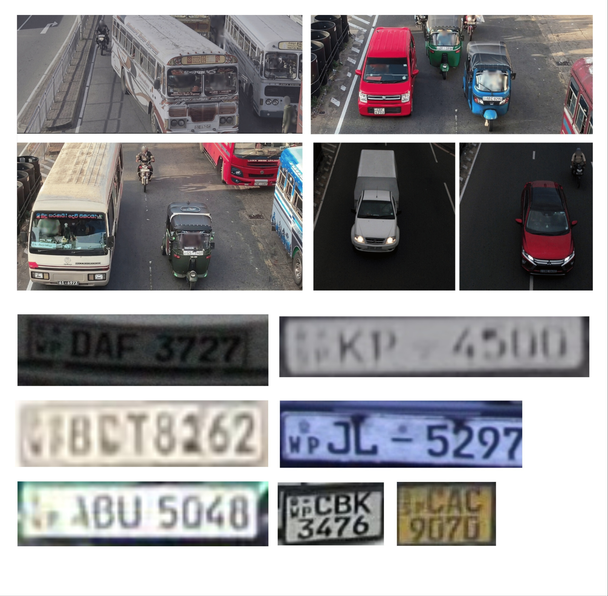

# SL-LPR: Sri Lankan License Plate Recognition Dataset ([Website](https://sllpr.tronicgen.com))

By **Anuki Pasqual**, **Manimohan Thiriloganathan**, **Dulan Lokugeegana**, **Nuthya Rathnayake**  
Department of Electronic and Telecommunication Engineering  
University of Moratuwa, Sri Lanka  
{pasqualac.20, manimohant.20, lokugeeganadl.20, rathnayakernp.20}@uom.lk  

---

## Overview

**SL-LPR** is a real-world dataset designed for **license plate detection and recognition in complex Sri Lankan traffic scenes**. Existing datasets fail to capture the diversity of vehicle types and non-lane-disciplined traffic conditions found in Sri Lanka.  

To address this, we collected and annotated a dataset covering:
- Multiple vehicle types (cars, buses, trucks, motorbikes, three-wheelers)
- Multi-lane traffic scenes
- Varying traffic densities
- Daytime and low-light (dusk) conditions

This dataset supports research in:
- License Plate Detection (LPD)
- License Plate Recognition (LPR)
- Intelligent Transportation Systems (ITS)

---

## Dataset Highlights

### 🔹 Detection Dataset
- **Total images:** 2970  
- **Annotations:** Bounding boxes (manually labeled)  


### 🔹 Recognition Dataset
- **Total license plates:** 3412  
- **Label format:** Standardized to `CAA 0923` (8-character format)  


### 🔹 Recognition Annotation Details

- Duplicate filtering applied (max 3 per plate with varying clarity)  
- Unreadable images removed  

---

## Dataset Creation

We captured videos from:
- Overhead bridges in urban roads  
- Expressways in Sri Lanka  

---

## Key Features

- Real-world Sri Lankan traffic (non-lane-disciplined)
- Multi-vehicle, multi-lane scenarios  
- Lighting variations (day & dusk)  
- Diverse plate formats  
- Privacy-preserved (faces blurred)  
- Carefully curated and bias-reduced dataset  

---

## Associated Paper

**Title:**  
*An Embedded Real-Time License Plate Recognition System for Complex Traffic Scenes*  

📍 Accepted at:  
**IEEE Intelligent Transportation Systems Society Conference (ITSC 2026), Naples, Italy**

🔗 Paper link: *Coming soon*  
📌 Citation: *Will be added soon*

---

## Sample Data

Example images include:
- Multi-lane road scenes  
- Various vehicle types  
- Plates with different clarity levels and formats  

Here are some examples from the dataset:



---

## Data Download

1. [Get Access](#how-to-request-access)  
2. [Restriction](#usage-policy--restriction)  
3. [Download Link](#download-link)  

---

## How to Request Access

You can request access via **email or website**.

### 📧 Email Request (Copy-Paste Format)

```text
Subject: Request for SL-LPR Dataset Access

Dear Sir/Madam,

I would like to request access to the SL-LPR (Sri Lankan License Plate Recognition) dataset for research purposes.

Name:
Affiliation:
Department:
Position:
Email:
Postal Address:
Phone Number:
Purpose of Use:

I have read and agreed to follow the restrictions specified for the SL-LPR dataset.
This dataset will only be used for research purposes.
I will not redistribute, share, or use it for commercial purposes.

Thank you for your time and consideration.

Signature:
```


📧 Send to: **manimohan517@gmail.com**

> ⚠️ Note:
> - Prefer using a university/institution email  
> - Response time: ~3–7 working days  

---

## Usage Policy / Restriction

To ensure proper use:

1. Dataset is **for research purposes only**  
2. **No redistribution** allowed  
3. **No commercial use**  
4. Must **cite the paper** (once available)  

Failure to follow these rules may result in access restrictions.

---

## Download Link

🔗 Will be available soon via:  
https://sllpr.tronicgen.com  

---

## Updates

| Date | Update |
|------|--------|
| 2026 | Initial release |
| Upcoming | Paper + citation |

---

## Contact

📧 Dataset Administrator: **manimohan517@gmail.com**

---

## Acknowledgment

We thank the Department of Electronic and Telecommunication Engineering, University of Moratuwa, for supporting this work.